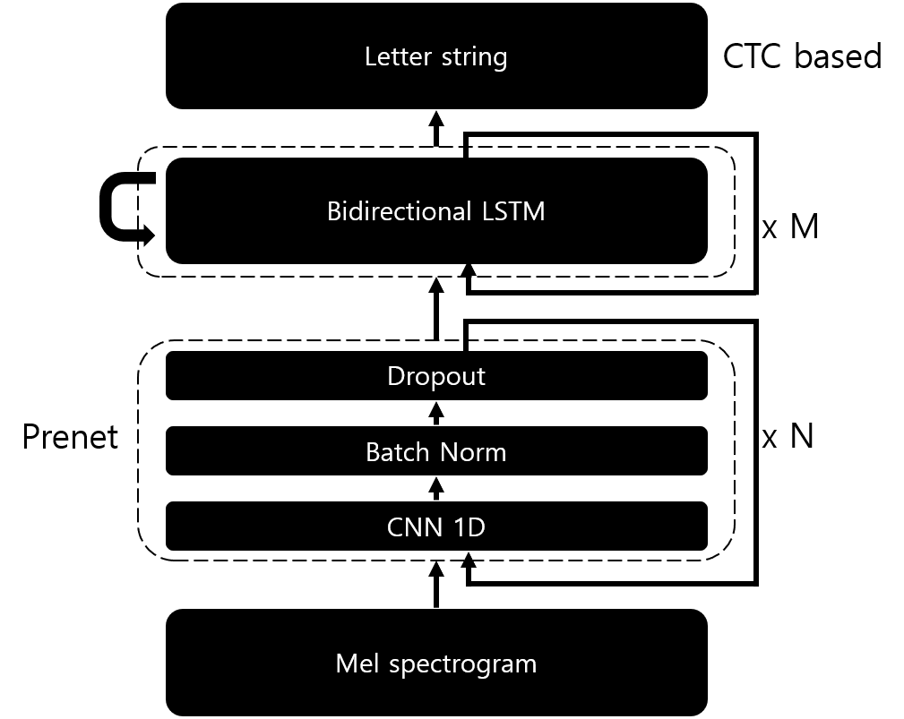

# Deep Speech 2

This code is a TF 2.0 implementation of the paper 'Deep Speech 2: End-to-End Speech Recognition in English and Mandarin'. The algorithm is based on the following papers:

    Amodei, D., Ananthanarayanan, S., Anubhai, R., Bai, J., Battenberg, E., Case, C., ... & Chen, J. (2016, June). Deep speech 2: End-to-end speech recognition in english and mandarin. In International conference on machine learning (pp. 173-182).

# Structure


# Used dataset
I used speech files with a length between 0.5s and 12s in the following datasets. Length can be modified in 'Hyper_Parameters.json'

    VCTK: https://datashare.is.ed.ac.uk/handle/10283/2651
    LibriSpeech: http://www.robots.ox.ac.uk/~vgg/data/voxceleb/    
    TIMIT: http://academictorrents.com/details/34e2b78745138186976cbc27939b1b34d18bd5b3

# Instruction

## ※About 'Use_Transformer' parameter in 'Hyper_Parameter.json'

* When 'Use_Transformer' parameter is false, model use 'Bidirectional LSTM.' In this case, the 'Transformer' related parameters are ignored.
* If 'Use transformer' is true, 'BiLSTM' related parameters are ignored.
* Transformers based model does not work. This part is the code for my test. Please use bidirectional LSTM.

## Pattern generate

    python Pattern_Generator.py [options]

* `-vctk <path>`
    * Set the path of VCTK.
    * VCTK dataset based patterns are generated.
* `-ls <path>`
    * Set the path of LibriSpeech.
    * LibriSpeech dataset based patterns are generated.
* `-timit <path>`
    * Set the path of TIMIT.
    * TIMIT dataset based patterns are generated.
* `-all`
    * All save option.
    * Generator ignore the 'Min_Wav_Length' and 'Max_Wav_Length' parameters in train of hyper parameter.
    * If this option is not set, only patterns matching 'Min_Wav_Length' and 'Max_Wav_Length' will be generated.

## Train

    python Model.py

The model stops learning only when you force stop (e.g. Ctrl + C).

## Inference

1. Run 'ipython' in the model's directory.
2. Run following command:

    ```
    from Model import DeepSpeech2
    new_Model = DeepSpeech2(is_Training= False)
    new_Model.Restore()
    ```

3. Set the wav path list like the following example:

    ```
    path_List = [
        './Inference_Test/LJ050-0277.wav',
        './Inference_Test/17-363-0039.wav'
        ]
    ```

4. Run following command:

    ```
    new_Model.Inference(wav_Path_List= path_List, label= 'New_Inference')
    ```

5. Check the 'Inference.txt' of inference directory which is set at 'Inference_Path' of hyper parameter.

# Result

* This result is with uploaded parameters.

* Dataset: LJSpeech 'LJ050-0277.wav'
    * Original
        ```
        with the active cooperation of the responsible agencies and with the understanding of the people of the United States in their demands upon their President
        ```
    * Model export
        ```
        WITH THE ACTIVF COOPERATION OF THE RESPONSIBLE AGENTCEES AND WITH THE UNDERSTANDING OF THE PEOPLE OF THE UNITED STATES IN THER DEMANDS UPON THEIR PRESIDENT
        ```
    * Model raw export
        ```
        WITH TTHE ACCTTIVF  COO//OPPPERAATTIONN OF THE  REESPOON/SIIBLLE  AA/GEEENTCC/E/EESS/       AANDD WWITH THE UUNDERSSTAANDING OFF THE PEOPLE OF THE UUNIITEED STTATEES IN  THERR  DEEMAANDS  UPPOON THEIRR PREESIDEENTT////////////////////////////////////////////////////////////////////////////////////////////////////////////////////////////////////////////////////////////
        ```

* Dataset: LibriSpeech '2060-150855-0020.flac'
    * Original
        ```
        NOT BECAUSE A UNIVERSITY IS SMART BUT BECAUSE THOSE ARE THE MAGIC YEARS AND WITH LUCK YOU SEE UP THERE WHAT YOU COULDN'T SEE BEFORE AND MAYN'T EVER SEE AGAIN AREN'T THESE THE MAGIC YEARS THE LADY DEMANDED HE LAUGHED AND HIT AT HER
        ```
    * Model export
        ```
        NOT BECAUSE THE UNIVERSITY IS SMART BUT BECAUSE THOSE OF THEM MAGIC CEARS AND WITH LARK YOU SEE AT THERE WHAT YOU COULD TO SEE BEFORE A MAN  EVER SEE AGAIN AUTES THE MAGIC HERES THE LADY DEMANDED HE DELAUGHD AND HID AD HER
        ```
    * Raw export
        ```
        NOTT BECAUSSE THE UUNNIVERRSIIT/Y  IS  SSMMARRRTTT  BUT  BECCAUSSE   THOOSE  OF  THEM MAA/GIIC/ CE/ARRSS            //AANNNDD  WWITH  LAARKK  YOU SE/E AT THEERE WHAT YOU COULD TO  SE/E  BEFFORRE  A   MAANN /  EVVERR SE/E  AAGGAIINN            /////////////AU//TTTEESSS THE MMA/GGICC HE/RRESSS THHE LAADDY  DE//MANNDEED              //HEE  DELLAUGGHDD AND HIDD AADD  HERR
        ```

# Trained checkpoint file
The performance is not best. This checkpoint is only an approximate lesson, and no parameter optimization has been performed.

https://drive.google.com/drive/folders/1dnTcknot8y26VMnjQSulwHkZWg41iQbF?usp=sharing

# Future works

Explore the possibility of changing RNN part to Transformer
